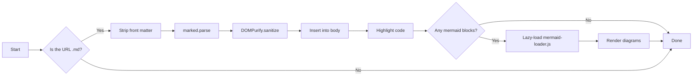
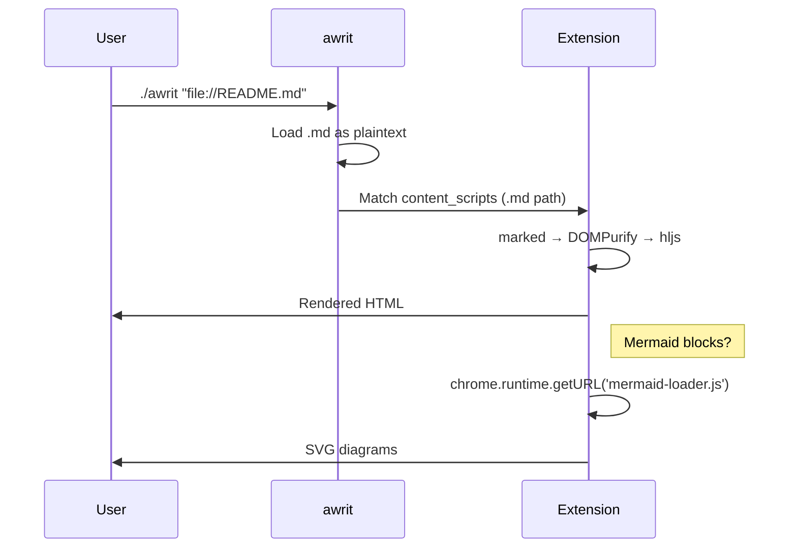
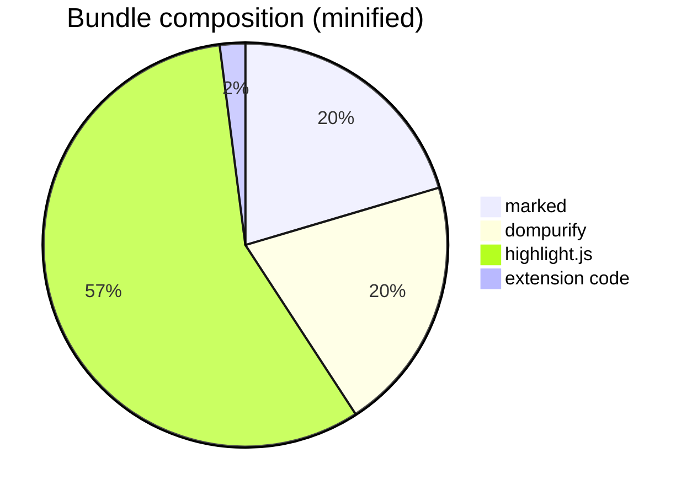

# awrit Markdown Renderer Test

This file exercises every feature of the bundled markdown renderer. If everything below renders correctly, the extension is healthy.

> The YAML block at the top of this file is **front matter**. If you can see it
> rendered as a horizontal rule and key-value text above this paragraph, the
> front-matter stripping is broken.

## Quick navigation

Click any of these to jump to the section. They use auto-generated heading IDs.

- [Inline formatting](#inline-formatting)
- [Lists](#lists)
- [Code blocks (syntax highlighting)](#code-blocks-syntax-highlighting)
- [Tables](#tables)
- [GitHub-style alerts](#github-style-alerts)
- [Blockquotes and rules](#blockquotes-and-rules)
- [Mermaid diagrams](#mermaid-diagrams)
- [Sanitization (should be safe)](#sanitization-should-be-safe)

## Inline formatting

Plain text with **bold**, *italic*, ***bold italic***, ~~strikethrough~~, and `inline code`. An autolink: <https://github.com/chase/awrit>. An external link with the off-host indicator: [Kitty graphics protocol](https://sw.kovidgoyal.net/kitty/graphics-protocol/). A relative link (no indicator expected): [README](./README.md).

Footnotes work: this sentence has a reference[^1], and so does this one[^longer-name]. Click a number to jump to the definition; click the back-arrow to return.

[^1]: First footnote definition. The numbering is independent of the label.
[^longer-name]: Footnote labels can be alphanumeric and use dashes/underscores. The rendered superscript is still a number in document order.

## Headings (h1 through h6)

### Level three

#### Level four

##### Level five

###### Level six

Hover any heading to reveal its `#` anchor link.

## Lists

### Unordered

- First item
- Second item with **emphasis**
  - Nested item
  - Another nested
    - Triple-nested
- Third item

### Ordered

1. Setup
2. Render
3. Review

### Task list

- [x] Enable GitHub-flavored Markdown
- [x] Wire up `marked-gfm-heading-id`
- [ ] Add print stylesheet
- [ ] Add table of contents sidebar

## Code blocks (syntax highlighting)

TypeScript:

```typescript
import { marked } from 'marked';

export async function renderMarkdown(source: string): Promise<string> {
  // GFM is enabled by default in marked v18.
  return await marked.parse(source);
}
```

Python:

```python
from dataclasses import dataclass

@dataclass
class Greeting:
    name: str

    def say(self) -> str:
        return f"Hello, {self.name}!"

print(Greeting("world").say())
```

Rust:

```rust
fn main() {
    let names = vec!["alice", "bob", "carol"];
    for (i, name) in names.iter().enumerate() {
        println!("{i}: {name}");
    }
}
```

Bash:

```bash
#!/usr/bin/env bash
set -euo pipefail

# Find every markdown file under src/, excluding tests.
find src -type f -name '*.md' ! -name '*.test.md'
```

JSON:

```json
{
  "manifest_version": 3,
  "name": "awrit Markdown Renderer",
  "permissions": ["storage"],
  "host_permissions": ["<all_urls>"]
}
```

YAML:

```yaml
build:
  target: browser
  format: iife
  minify: true
deps:
  - marked
  - dompurify
  - highlight.js
```

CSS:

```css
.awrit-markdown {
  font-family: system-ui, sans-serif;
  line-height: 1.6;
}
```

A code block with no language hint (auto-detect):

```
function greet(who) {
  return "Hello, " + who;
}
```

Hover any block above to reveal its **Copy** button.

## Tables

| Feature | Status | Notes |
|---|---|---|
| Headings + anchors | ✅ | `marked-gfm-heading-id` |
| Syntax highlighting | ✅ | `highlight.js/lib/common` (~35 langs) |
| Front matter stripping | ✅ | YAML only |
| Mermaid | ✅ | Lazy-loaded |
| Copy button | ✅ | Hover any `<pre>` |
| Sanitization | ✅ | DOMPurify |

| Left-aligned | Centered | Right-aligned |
|:---|:---:|---:|
| `marked` | 18.0.2 | 50KB |
| `dompurify` | 3.4.1 | 50KB |
| `highlight.js` | 11.11.1 | ~50KB |
| `mermaid` | 11.14.0 | ~3MB |

## GitHub-style alerts

> [!NOTE]
> Alerts are styled blockquotes with a colored left border. Five types are supported.

> [!TIP]
> Each variant has its own color: note (blue), tip (green), important (purple), warning (yellow), caution (red).

> [!IMPORTANT]
> The alert title is rendered above the body in a bold, color-matched line.

> [!WARNING]
> Make sure the markdown source uses the exact `[!TYPE]` format on its own line at the start of the blockquote.

> [!CAUTION]
> Misspelled types (e.g. `[!notice]`) fall back to a plain blockquote.

## Blockquotes and rules

> This is a blockquote.
>
> > This is a nested blockquote — useful for replies.
>
> Blockquotes can contain `inline code` and **bold** text.

---

A horizontal rule sits above this line.

## Mermaid diagrams

A flowchart:



A sequence diagram:



A pie chart:



## Sanitization (should be safe)

The block below contains a `<script>` tag inside markdown's raw-HTML passthrough. DOMPurify should strip it. If you see an alert popup or this paragraph is missing, sanitization is broken.

<script>alert('XSS — should never run')</script>

Inline event handlers should also be stripped:

<a href="#" onclick="alert('XSS')">This link should be inert</a>

## Done

If you've scrolled this far and everything looks right, the renderer works.
